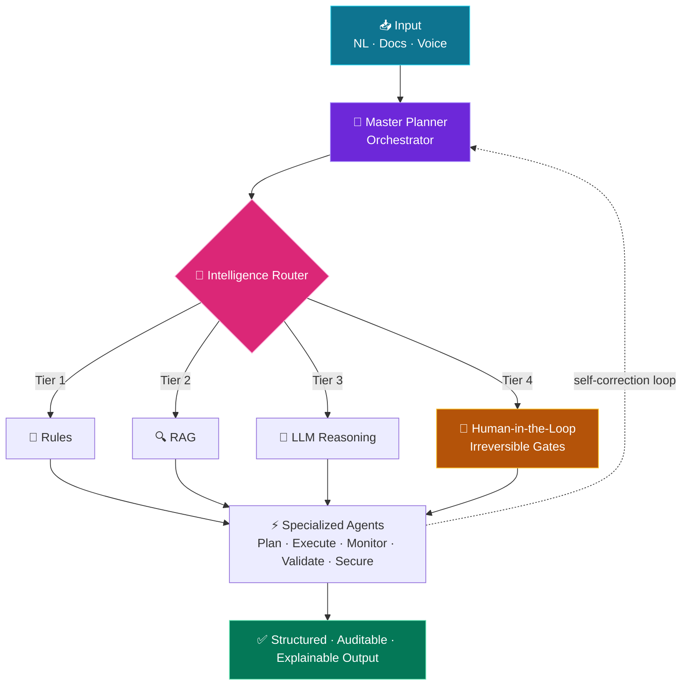

<!-- ====================== HEADER ====================== -->
<a name="top"></a>

<p align="center">
  
</p>

<div align="center">

<a href="https://github.com/venkatatharunparsa">
  
</a>

<br/>

[](https://www.linkedin.com/in/venkata-tharun-parsa-98850632a/)
[](mailto:parsavenkatatharun@gmail.com)
[](https://github.com/venkatatharunparsa)
[](https://github.com/venkatatharunparsa)

<br/>

`📍 Hyderabad, India`  ·  `🎓 B.Tech CSE — RGUKT (2027)`  ·  `🚀 Open to internships & AI engineering roles`

</div>

<!-- ====================== ABOUT ====================== -->
<br/>

## 🧠 About Me

```python
class TharunParsa:
    def __init__(self):
        self.role        = "Agentic AI Engineer"
        self.focus       = ["Multi-Agent Orchestration", "RAG Pipelines", "Cloud-Native MLOps"]
        self.stack       = ["LangChain", "LangGraph", "CrewAI", "FastAPI", "AWS", "Docker"]
        self.philosophy  = "Every decision traceable · every action intentional · every failure self-correcting"
        self.currently   = "Architecting autonomous agents that reason, act, and recover"

    def deliver(self):
        return "Production AI systems with audit-ready, explainable outputs"
```

I architect **end-to-end AI systems** that combine LLMs, multimodal models, and autonomous agents — for compliance automation, infrastructure management, and creative production workflows.

<div align="center">

| 🎯 Focus Area | 💡 What I Deliver |
| :--- | :--- |
| **Multi-Agent Systems** | Master planners, specialized agents, human-in-the-loop gates |
| **RAG Pipelines** | Self-improving knowledge bases, vector retrieval, audit-ready outputs |
| **Production AI** | Containerized deploys, CI/CD, observability, failure-recovery loops |
| **Multimodal AI** | Vision-language pipelines with consistency & validation |

</div>

<!-- ====================== TECH STACK ====================== -->
<br/>

## 🛠️ Tech Arsenal

<div align="center">

**🤖 Agents & Orchestration**


**🔍 RAG & Retrieval**


**🧬 Models & Vision**


**⚙️ Backend & Languages**


**☁️ Cloud & MLOps**


</div>

<!-- ====================== ARCHITECTURE ====================== -->
<br/>

## 🏗️ How I Design Agent Systems



> Every decision is **traceable**, every action is **intentional**, and every failure has a **self-correction path**.

<!-- ====================== PROJECTS ====================== -->
<br/>

## 🚀 Featured Projects

<table>
<tr>
<td width="50%" valign="top">

### 🌩️ [InfraGenie](https://github.com/venkatatharunparsa)
**Agentic Cloud Infrastructure Platform**

Production **5-agent system** (Orchestrator, Planner, Executor, Monitor, Security) that provisions and manages AWS infrastructure from natural language.

- 🧠 **4-tier router:** rules → RAG → LLM → human-in-the-loop
- 🔄 **Self-improving RAG** across 6 ChromaDB collections
- 🛡️ **IaC governance:** Terraform + tfsec + Checkov + Infracost
- 📡 Real-time **WebSocket** dashboard with self-correction

`Python` `FastAPI` `Gemini` `ChromaDB` `Terraform` `AWS` `Docker`

</td>
<td width="50%" valign="top">

### 🧾 [TaxSetu](https://github.com/venkatatharunparsa)
**Autonomous Multi-Agent GST Compliance**

End-to-end GST automation for **7.34 crore MSMEs**, with multilingual support.

- 🎯 **Master Planner** orchestrating **5 specialized agents**
- 📑 OCR + tax computation + multi-step reasoning
- 🔎 **Explainable, audit-ready** structured outputs
- ⚖️ Decision pipelines built for regulatory traceability

`LangChain` `LangGraph` `Gemini` `FAISS` `FastAPI` `AWS`

</td>
</tr>
<tr>
<td width="50%" valign="top">

### 🎬 [VisionSync](https://github.com/venkatatharunparsa)
**Character & Scene Planning for Film Pre-Viz**

Multimodal pipeline for film pre-visualization with consistency enforcement.

- 🎭 **95% character consistency** across 100+ frames (custom LoRA)
- 🤖 **6-agent system** for scene planning & risk prediction
- ⚡ **90%** faster storyboards · **80%** lower API usage

`SDXL` `LoRA` `RAG` `Gemini Vision` `LangChain` `FAISS`

</td>
<td width="50%" valign="top">

### 🎙️ [NINA](https://github.com/venkatatharunparsa)
**Voice-Driven Browser Automation Agent**

Voice-to-action automation with dynamic DOM understanding — no manual site config.

- 🧩 Custom **Field Registry** for plug-and-play SDK integration
- 🔁 Multi-step task execution with robust session recovery
- 🗣️ Natural-language commands → browser actions

`Playwright` `Python` `NLP` `FastAPI`

</td>
</tr>
<tr>
<td width="50%" valign="top">

### 📦 [AstraDeploy](https://github.com/venkatatharunparsa)
**AI Deployment & Monitoring Platform**

Cloud-native MLOps platform for deploying and operating AI systems at scale.

- 🔧 Automated CI/CD with containerized, auto-scalable infra
- 📊 Real-time observability via Grafana & CloudWatch
- 🛠️ Built for production reliability

`AWS` `Docker` `Jenkins` `Grafana` `CloudWatch` `CI/CD`

</td>
<td width="50%" valign="top">

### 🧪 More on the way...
**Exploring next**

- 🔬 Stronger agent self-correction & evaluation loops
- 🖼️ Multimodal LLMs for real-world automation
- 📚 Production RAG: retrieval quality & offline eval

[**→ Browse all repositories**](https://github.com/venkatatharunparsa?tab=repositories)

</td>
</tr>
</table>

<!-- ====================== EXPERIENCE ====================== -->
<br/>

## 💼 Experience

**☁️ Azure Cloud Intern** — *Microsoft Elevate Program · Microsoft India*

- Deployed and managed cloud infrastructure — VMs, storage, and networking on Azure
- Applied monitoring and scalability practices for production AI workloads
- Supported AI deployment workflows using cloud and MLOps principles

<!-- ====================== STATS ====================== -->
<br/>

## 📊 GitHub Analytics

<div align="center">


<br/>


<br/>


</div>

<!-- ====================== SNAKE ====================== -->
<br/>

## 🐍 Contribution Graph

<div align="center">


</div>

<!-- ====================== EDUCATION & ACHIEVEMENTS ====================== -->
<br/>

## 🎓 Education & 🏆 Achievements

<table>
<tr>
<td width="50%" valign="top">

**🎓 Education**

**B.Tech, Computer Science & Engineering** — CGPA **8.5**
Rajiv Gandhi University of Knowledge Technologies (RGUKT), Basar
*Expected 2027*

**📜 Certifications**
- **IBM** — RAG & Agentic AI Professional Certificate
- **IBM** — DevOps & Software Engineering Professional Certificate
- **Microsoft** — Elevate Program (Azure Cloud Intern)

</td>
<td width="50%" valign="top">

**🏆 Achievements**

| Event | Result | When |
| :--- | :--- | :--- |
| Smart India Hackathon (Internal), RGUKT | 🥇 **Winner** | 2025 |
| Cine AI Hackathon, T-Works Hyderabad | 🏅 **Top 6 Finalist** | Jan 2026 |
| Build for India, Kerala Startup Mission | 🎫 Participant | Feb 2026 |
| Tutedude Hackathon | 🎫 Participant | 2025 |

</td>
</tr>
</table>

<!-- ====================== FOOTER ====================== -->
<br/>

## 🤝 Let's Build Something

<div align="center">

**Interested in collaborating or hiring?**

[](https://www.linkedin.com/in/venkata-tharun-parsa-98850632a/)
[](mailto:parsavenkatatharun@gmail.com)

</div>

<p align="center">
  
</p>

<div align="center">

<sub>⭐ <i>"The best way to predict the future is to build the agents that automate it."</i></sub>

<a href="#top">↑ Back to top</a>

</div>
